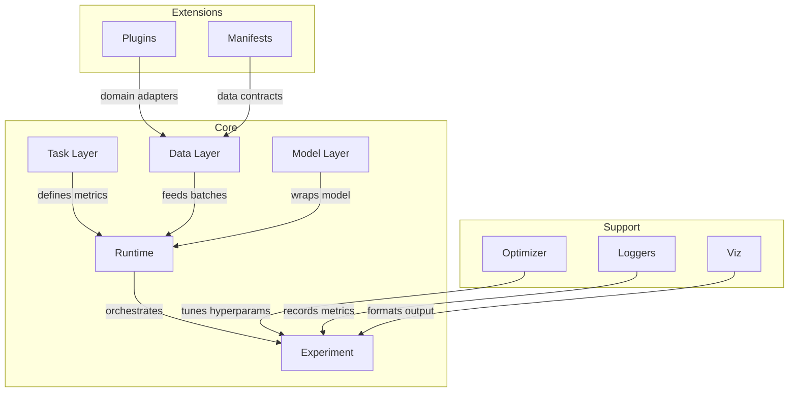

# LIULIAN

**Liquid Intelligence and Unified Logic for Interactive Adaptive Networks**

> *Where Space and Time Converge in Intelligence*

---

A research-oriented Python library for spatiotemporal model experimentation — training, evaluation, and inference over time-series, graph, and spatiotemporal data.

## Architecture



## What is LIULIAN?

LIULIAN is a **task-driven experiment framework** designed for researchers working with spatiotemporal and time-series data. It provides:

- **Task as first-class citizen** — define task semantics (metrics, loss, batch preparation) separately from model logic.
- **Data contracts & provenance** — YAML manifests with semantic field schemas, topology support, and integrity hashing.
- **Unified model interface** — `ExecutableModel` ABC with a lightweight adapter pattern; wrap any model (PyTorch, sklearn, custom) behind a consistent API.
- **State × Mode runner** — a state machine orchestrating `train → eval → infer` lifecycles with hooks for callbacks and artifact persistence.
- **Experiment as object** — full configuration, metrics, and artifacts captured for reproducibility.

## Quick Start

### Installation

```bash
# Install with uv (recommended)
uv pip install -e .

# With optional extras
uv pip install -e ".[dev]"         # development tools
uv pip install -e ".[logging]"     # WandB integration
uv pip install -e ".[hpo]"         # Ray Tune hyperparameter optimization
uv pip install -e ".[docs]"        # MkDocs documentation
```

### Minimal Example

```python
import numpy as np
from liulian.tasks.base import PredictionTask, PredictionRegime
from liulian.data.base import DataSplit
from liulian.adapters.dummy import DummyModel

# 1. Define a task
regime = PredictionRegime(input_length=10, forecast_horizon=3, output_type="deterministic")
task = PredictionTask(regime=regime)

# 2. Prepare data
train_data = DataSplit(
    x=np.random.randn(100, 10, 2).astype(np.float32),
    y=np.random.randn(100, 3, 2).astype(np.float32),
    split_name="train",
)

# 3. Create & configure model
model = DummyModel()
model.configure({"forecast_horizon": 3, "n_features": 2})

# 4. Run prediction and evaluate
predictions = model.forward(train_data.x)
metrics = task.compute_metrics(predictions, train_data.y)
print(metrics)  # {'mse': ..., 'mae': ..., 'rmse': ...}
```

See [examples/quick_run.py](examples/quick_run.py) for a full end-to-end example including the `Experiment` orchestrator.

## Core Concepts

| Concept | Module | Description |
|---|---|---|
| **Task** | `liulian.tasks` | Defines what to predict, how to measure, and how to prepare batches |
| **Data** | `liulian.data` | Dataset abstraction with field specs, topology, and YAML manifests |
| **Model** | `liulian.models` | `ExecutableModel` ABC — the contract every model adapter must implement |
| **Adapter** | `liulian.adapters` | Concrete model wrappers (e.g., `DummyModel` baseline) |
| **Runtime** | `liulian.runtime` | State machine + `Experiment` orchestrator for lifecycle management |
| **Optimizer** | `liulian.optim` | Hyperparameter optimization (Ray Tune with grid-sweep fallback) |
| **Loggers** | `liulian.loggers` | Metric logging — local JSON-lines files and WandB |
| **Plugins** | `plugins/` | Domain-specific dataset adapters (hydrology, traffic, etc.) |

## Adapter Rules

Models are wrapped via the `ExecutableModel` interface. Key rules:

- **Allowed**: import and wrap any external model library inside your adapter
- **Forbidden**: domain-specific logic leaking into core modules
- All adapters must implement: `configure()`, `forward()`, `save()`, `load()`
- Each adapter declares its `capabilities` (e.g., `["deterministic"]`)

See the [Adapter Guide](docs/adapter_guide.md) for the full contract specification.

## Project Structure

```
liulian-python/
├── liulian/               # Core library
│   ├── tasks/             # Task definitions & metrics
│   ├── data/              # Dataset abstractions & manifests
│   ├── models/            # ExecutableModel ABC
│   ├── adapters/          # Model wrappers (DummyModel, ...)
│   ├── runtime/           # State machine & Experiment
│   ├── optim/             # Hyperparameter optimization
│   ├── loggers/           # Logging backends
│   ├── viz/               # Visualization utilities
│   ├── utils/             # Shared helpers
│   └── cli.py             # CLI entry point
├── plugins/               # Domain plugins
│   ├── hydrology/         # SwissRiver adapter
│   └── traffic/           # Traffic adapter (stub)
├── manifests/             # Dataset manifests
├── tests/                 # Test suite (66 tests, 81% coverage)
├── examples/              # Runnable examples
├── docs/                  # MkDocs documentation
└── pyproject.toml         # PEP 621 metadata
```

## Development

```bash
# Clone and install
git clone https://github.com/jajupmochi/liulian-python.git
cd liulian-python
uv pip install -e ".[dev,logging]"

# Run tests
pytest -v --tb=short

# Run with coverage
pytest --cov=liulian --cov-report=term-missing

# Format code
black liulian/ tests/
isort liulian/ tests/

# Type check
mypy liulian/
```

## Roadmap

**MVP1 (current):**
- [x] Task-driven experiment paradigm
- [x] Data contracts with YAML manifests
- [x] ExecutableModel + DummyModel adapter
- [x] State machine runtime + Experiment orchestrator
- [x] Ray Tune optimizer with fallback
- [x] Local + WandB logging
- [x] Hydrology plugin (SwissRiver)
- [x] 60%+ test coverage

**v1+ (planned):**
- [ ] FastAPI experiment server
- [ ] Online / streaming mode
- [ ] Human-in-the-loop (HITL) integration
- [ ] PyTorch / sklearn adapter library
- [ ] Probabilistic output support
- [ ] Dashboard / Web UI
- [ ] Extended plugin ecosystem

## Contributing

See [CONTRIBUTING](docs/contributing.md) for development guidelines, code style, and PR process.

## License

[MIT](LICENSE) © 2026

## Citation

If you use LIULIAN in your research, please cite:

```bibtex
@software{liulian2026,
  title  = {LIULIAN: Liquid Intelligence and Unified Logic for Interactive Adaptive Networks},
  author = {LIULIAN Contributors},
  year   = {2026},
  url    = {https://github.com/jajupmochi/liulian-python}
}
```