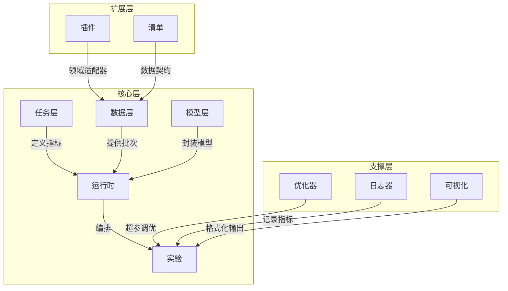

# LIULIAN（流联）

**Liquid Intelligence and Unified Logic for Interactive Adaptive Networks**

> *时空交汇处，智能涌现时*

---

面向时空模型实验的研究型 Python 库 —— 支持时间序列、图结构与时空数据的训练、评估和推理。

## 架构概览



## 什么是 LIULIAN？

LIULIAN 是一个**以任务为中心的实验框架**，面向时空及时间序列数据的研究人员，提供以下核心能力：

- **任务即一等公民** —— 将任务语义（指标、损失、批次准备）与模型逻辑分离定义。
- **数据契约与溯源** —— 基于 YAML 清单（manifest）的语义字段模式、拓扑支持与完整性哈希。
- **统一模型接口** —— `ExecutableModel` 抽象基类 + 轻量适配器模式；可将任意模型（PyTorch、sklearn 等）封装到一致的 API 之后。
- **状态 × 模式运行器** —— 状态机编排 `train → eval → infer` 生命周期，支持回调钩子和产物持久化。
- **实验即对象** —— 完整的配置、指标和产物捕获，确保可复现性。

## 快速开始

### 安装

```bash
# 使用 uv 安装（推荐）
uv pip install -e .

# 安装可选依赖
uv pip install -e ".[dev]"         # 开发工具
uv pip install -e ".[logging]"     # WandB 集成
uv pip install -e ".[hpo]"         # Ray Tune 超参优化
uv pip install -e ".[docs]"        # MkDocs 文档
```

### 最小示例

```python
import numpy as np
from liulian.tasks.base import PredictionTask, PredictionRegime
from liulian.data.base import DataSplit
from liulian.adapters.dummy import DummyModel

# 1. 定义任务
regime = PredictionRegime(input_length=10, forecast_horizon=3, output_type="deterministic")
task = PredictionTask(regime=regime)

# 2. 准备数据
train_data = DataSplit(
    x=np.random.randn(100, 10, 2).astype(np.float32),
    y=np.random.randn(100, 3, 2).astype(np.float32),
    split_name="train",
)

# 3. 创建并配置模型
model = DummyModel()
model.configure({"forecast_horizon": 3, "n_features": 2})

# 4. 运行预测和评估
predictions = model.forward(train_data.x)
metrics = task.compute_metrics(predictions, train_data.y)
print(metrics)  # {'mse': ..., 'mae': ..., 'rmse': ...}
```

完整的端到端示例（包含 `Experiment` 编排器）请参阅 [examples/quick_run.py](examples/quick_run.py)。

## 核心概念

| 概念 | 模块 | 描述 |
|---|---|---|
| **任务** | `liulian.tasks` | 定义预测目标、评估指标和批次准备方式 |
| **数据** | `liulian.data` | 数据集抽象，支持字段规范、拓扑和 YAML 清单 |
| **模型** | `liulian.models` | `ExecutableModel` 抽象基类 —— 所有模型适配器必须实现的契约 |
| **适配器** | `liulian.adapters` | 具体模型封装（如 `DummyModel` 基线模型） |
| **运行时** | `liulian.runtime` | 状态机 + `Experiment` 编排器，管理生命周期 |
| **优化器** | `liulian.optim` | 超参数优化（Ray Tune + 网格搜索回退） |
| **日志器** | `liulian.loggers` | 指标日志 —— 本地 JSON-lines 文件和 WandB |
| **插件** | `plugins/` | 领域特定的数据集适配器（水文、交通等） |

## 适配器规则

模型通过 `ExecutableModel` 接口封装。核心规则：

- **允许**：在适配器内部导入和封装任意外部模型库
- **禁止**：领域特定逻辑泄漏到核心模块
- 所有适配器必须实现：`configure()`、`forward()`、`save()`、`load()`
- 每个适配器声明其 `capabilities`（如 `["deterministic"]`）

详见[适配器指南](docs/adapter_guide.md)了解完整的契约规范。

## 项目结构

```
liulian-python/
├── liulian/               # 核心库
│   ├── tasks/             # 任务定义与指标
│   ├── data/              # 数据集抽象与清单
│   ├── models/            # ExecutableModel 抽象基类
│   ├── adapters/          # 模型封装器（DummyModel 等）
│   ├── runtime/           # 状态机与实验编排
│   ├── optim/             # 超参数优化
│   ├── loggers/           # 日志后端
│   ├── viz/               # 可视化工具
│   ├── utils/             # 共享辅助函数
│   └── cli.py             # CLI 入口
├── plugins/               # 领域插件
│   ├── hydrology/         # SwissRiver 适配器
│   └── traffic/           # 交通适配器（桩代码）
├── manifests/             # 数据集清单
├── tests/                 # 测试套件（66 个测试，81% 覆盖率）
├── examples/              # 可运行示例
├── docs/                  # MkDocs 文档
└── pyproject.toml         # PEP 621 元数据
```

## 开发

```bash
# 克隆并安装
git clone https://github.com/jajupmochi/liulian-python.git
cd liulian-python
uv pip install -e ".[dev,logging]"

# 运行测试
pytest -v --tb=short

# 带覆盖率运行
pytest --cov=liulian --cov-report=term-missing

# 代码格式化
black liulian/ tests/
isort liulian/ tests/

# 类型检查
mypy liulian/
```

## 路线图

**MVP1（当前）：**
- [x] 以任务为中心的实验范式
- [x] 基于 YAML 清单的数据契约
- [x] ExecutableModel + DummyModel 适配器
- [x] 状态机运行时 + Experiment 编排器
- [x] Ray Tune 优化器（含回退机制）
- [x] 本地 + WandB 日志
- [x] 水文插件（SwissRiver）
- [x] 60%+ 测试覆盖率

**v1+（规划中）：**
- [ ] FastAPI 实验服务器
- [ ] 在线/流式模式
- [ ] 人在回路（HITL）集成
- [ ] PyTorch / sklearn 适配器库
- [ ] 概率输出支持
- [ ] 仪表盘 / Web UI
- [ ] 扩展插件生态

## 贡献

参阅 [CONTRIBUTING](docs/contributing.md) 了解开发规范、代码风格和 PR 流程。

> **注意**：修改 README.md 后，请同步更新 README.zh.md 以保持中英文版本一致。

## 许可证

[MIT](LICENSE) © 2026

## 引用

如果您在研究中使用了 LIULIAN，请引用：

```bibtex
@software{liulian2026,
  title  = {LIULIAN: Liquid Intelligence and Unified Logic for Interactive Adaptive Networks},
  author = {LIULIAN Contributors},
  year   = {2026},
  url    = {https://github.com/jajupmochi/liulian-python}
}
```
