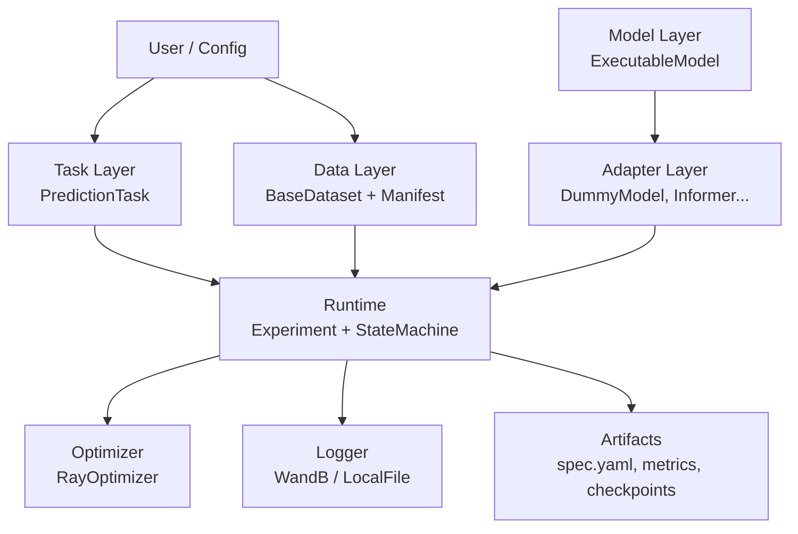

# Architecture

## Overview

LIULIAN follows a **task-driven experiment paradigm** where the Task is a first-class citizen. Every experiment is defined by the combination of a Task, Dataset, Model (Adapter), and Runner.

## Architecture Diagram

## Architecture Decisions

| Decision | Choice | Rationale |
|---|---|---|
| Dependency Management | `uv` | Fast, lock-file first, reproducible |
| Configuration | Env vars + YAML manifest | Stateless for CI/cloud; manifest for data provenance |
| Error Handling | Exceptions | Simple for MVP; validation errors only |
| Logging | stdlib `logging` + WandB | WandB for remote; fallback to local JSON |
| Testing | Unit + integration; 60% min | Smoke tests for adapters; e2e for runner |

## Module Responsibilities

### Task Layer (`liulian/tasks/`)
Defines **what** an experiment is trying to achieve — loss functions, evaluation metrics, and batch preparation. Tasks are task-agnostic to any specific model.

### Data Layer (`liulian/data/`)
Manages dataset abstractions, YAML manifests for provenance, data splits, and topology specs for spatiotemporal graphs.

### Model Layer (`liulian/models/`)
Provides the `ExecutableModel` abstract interface that all adapters must implement — `configure()`, `forward()`, `save()`, `load()`, `capabilities()`.

### Adapter Layer (`liulian/adapters/`)
One adapter per external library. Each adapter wraps a specific model implementation (e.g., DummyModel, Informer) behind the `ExecutableModel` interface.

**Contract rules:**
- Single responsibility (model wrapper only — no training loop, loss, metrics)
- ≤ 200 LOC per adapter
- All 3rd-party imports via `_vendor.py`
- Must declare `capabilities()`
- Must have a unit test

### Runtime Layer (`liulian/runtime/`)
Orchestrates the experiment lifecycle through a state machine (INIT → TRAIN → EVAL → INFER → COMPLETED) with support for pause/resume and event callbacks.

### Optimizer Layer (`liulian/optim/`)
Hyperparameter optimisation via Ray Tune with a fallback grid-sweep when Ray is not installed.

### Logger Layer (`liulian/loggers/`)
Unified logging interface. Full WandB SDK integration with automatic fallback to local JSON logging when WandB is unavailable.

## Plugin Architecture

Domain-specific code (hydrology, traffic, etc.) lives in `plugins/`, not in the core package. Plugins inherit from core ABCs and are loaded as regular Python imports.
