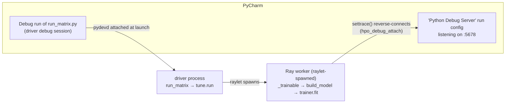

> **Language:** English | [中文](debugging_ray_hpo.zh.md)

# Debugging inside Ray Tune trials (PyCharm breakpoints in `_trainable`)

How to hit IDE breakpoints INSIDE a Ray Tune trial — `_trainable`, `build_model`,
`trainer.fit` running in a Ray worker — when driving the real matrix entry
(`experiments/hydro_llm/run_matrix.py`). Established 2026-08-10; verified live
(commits `83f541d` + `7c6ebf5`).

## 1. Why normal debugging cannot reach a trial

Ray 2.x always executes a Tune trainable in a **worker process spawned by the raylet**
(Ray's C++ node agent), never in the driver process you launched:

- A PyCharm **Debug** run attaches pydevd only to the **driver** (the process running
  `run_matrix.py` → `tune.run(...)`). Breakpoints in the driver — `build_overrides`,
  `build_optimizer`, the `tune.run` call site, the post-HPO retrain — hit normally.
- The raylet spawns workers outside Python's `subprocess`/`multiprocessing` machinery,
  so PyCharm's "attach to subprocess automatically" cannot follow them. Breakpoints
  inside `_trainable` are simply never registered in the worker.
- `hpo_local_mode: true` does NOT change this: on Ray 2.x it only forces
  `ray.init(num_cpus=1)` = **sequential trials, still in worker processes**. The real
  in-process `local_mode` flag was removed from Ray 2.x
  (see [ray_optimizer.py](../liulian/optim/ray_optimizer.py), the `_run_ray` init block).

The working pattern is the **reverse connection**: the worker itself dials back to a
listening PyCharm "Python Debug Server" (`pydevd_pycharm.settrace`), after which
breakpoints bind inside that worker.



## 2. One-time setup

1. **Package** (already in this repo's `.venv`):

   ```bash
   uv pip install pydevd-pycharm
   ```

   If the connection later fails with a protocol/handshake error, install the version
   matching your PyCharm build instead: **Help → About** shows the build (e.g.
   `PY-243.x`), then `uv pip install "pydevd-pycharm~=243.0"`.

2. **Create the Debug Server run configuration** in PyCharm:
   1. **Run → Edit Configurations… → + → Python Debug Server** (search "debug server"
      in the template list if it is long).
   2. Name it e.g. `ray-attach`; **Port** `5678`; **IDE host name** `localhost`. OK.

## 3. Per-session workflow (the order matters)

1. **Start the Debug Server FIRST**: select `ray-attach` in the top-right run-config
   dropdown and click the **Debug (bug) button**. The Debug tool window opens and its
   console shows:

   ```
   Starting debug server at port 5,678
   ...
   Waiting for process connection…
   ```

   Leave it open — it waits indefinitely and serves every trial that connects.

2. **Activate the config key**: in
   [experiments/hydro_llm/configs/debug.yaml](../experiments/hydro_llm/configs/debug.yaml)
   (HPO section) un-comment:

   ```yaml
   hpo_debug_attach: localhost:5678
   ```

   Accepted values: `true` (→ `localhost:5678`) or `"host:port"`.

3. **Set breakpoints** wherever you need them — BOTH sides work. TIP —
   **conditional breakpoints** work normally in the reverse-attached worker:
   right-click the red breakpoint dot → enter a Python expression in
   **Condition** (e.g. on the `entity_str = ...` line in `_compose_prompt`, use
   `bool(entity_desc)` — evaluated BEFORE the line runs, so test the inputs; on
   any line AFTER it, `entity_str != ''` works). The debugger pauses only when
   the expression is truthy.
   - driver side: `run_matrix.main`, `build_overrides`, `build_optimizer`,
     the `tune.run(run_trainable, **run_kwargs)` line, the post-HPO retrain;
   - worker side: `_trainable` (e.g. `merged = {**base_config, **config}`),
     `build_model`, `timellm.forecast`, `ForecastTrainer.fit`.

4. **Run the real entry as usual** — your normal **Debug** launch of the
   `run_matrix.py` run configuration (plain Run also works, but then only worker-side
   breakpoints stop; Debug covers both sides). Typical PyCharm run config:
   Script `experiments/hydro_llm/run_matrix.py`, parameters
   `--phase full --arch timellm --datasets swiss-river-1990 --modes none --seeds 2026
   --hpo-num-samples 2`, env `HYDRO_DEBUG=1;HF_HUB_OFFLINE=1;TRANSFORMERS_OFFLINE=1`,
   working dir = repo root. (`HYDRO_DEBUG=1` makes `--config` default to `debug.yaml`.)

5. **What you should observe**, in order:
   1. Trial output prints the attach confirmation:

      ```
      [hpo_debug_attach] Ray worker pid=<N> attached to PyCharm debug server localhost:5678
      ```

   2. The Debug tool window now has **two session tabs** — the driver session and the
      `ray-attach` server session (connected workers hang under the latter). A
      breakpoint pauses in whichever tab owns that process; switch tabs to inspect.
   3. With `hpo_local_mode: true` (debug.yaml default) trials are sequential, so
      workers connect one after another — each new trial re-connects and your
      breakpoints hit again in the next trial.

6. **When done: re-comment the key.** With the key active and no server listening, the
   next run fails immediately with a loud `RuntimeError` — this is deliberate ("you
   asked to debug; silently running undebugged is the worst outcome"), but it means a
   forgotten key blocks normal runs.

## 4. Headless / command-line verification

The same path can be exercised without clicking anything (used for the live
verification of this feature — the server must be listening):

```bash
HYDRO_DEBUG=1 HF_HUB_OFFLINE=1 TRANSFORMERS_OFFLINE=1 \
  .venv/bin/python experiments/hydro_llm/run_matrix.py \
  --phase full --arch timellm --datasets swiss-river-1990 --modes none \
  --seeds 2026 --hpo-num-samples 2 --run-tag attachtest
```

Then check the cell log for the attach line:

```bash
grep -a "hpo_debug_attach" artifacts/hydro_llm/attachtest/*/run.log
```

Expected: `[hpo_debug_attach] Ray worker pid=... attached to PyCharm debug server
localhost:5678` and zero tracebacks. If you set breakpoints in PyCharm, this CLI run
will genuinely pause there (resume with F9).

## 5. Troubleshooting (each row was hit for real)

| Symptom | Cause | Fix |
|---|---|---|
| Breakpoints in `_trainable` never hit, no attach line in the trial output | `hpo_debug_attach` still commented out (the reverse connection never activates) | Un-comment the key in debug.yaml (§3 step 2) |
| `RuntimeError: ... attaching to the PyCharm Debug Server at localhost:5678 failed with ConnectionRefusedError ...` inside the trial | Debug Server not started (or wrong port) | Start `ray-attach` FIRST (§3 step 1); check the port matches |
| `TypeError: settrace() got an unexpected keyword argument 'stdoutToServer'` | pydevd-pycharm ≥2xx renamed the redirect kwargs to snake_case; old camelCase names crash before connecting | FIXED in `7c6ebf5` (only version-stable kwargs are passed). If you see this, your tree predates the fix — pull |
| Attach line prints but breakpoints still pass through | pydevd protocol mismatch between the installed package and your PyCharm build | Reinstall matching version (§2 step 1); restart both the server and the run |
| PyCharm server console: `Warning: wrong debugger version. ... pip install pydevd-pycharm~=<build>` — and PyPI does NOT have that build (common for EAP/snap builds) | PyPI releases lag PyCharm builds | Run `bash scripts/install_pycharm_debugger.sh` — it locates your PyCharm installation, extracts its bundled exact-match debugger egg into the venv, and verifies the import (uv cannot install eggs). Re-run after any venv rebuild or PyCharm upgrade (hit 2026-08-10, verified) |
| `RuntimeError: hpo_debug_attach is set but pydevd-pycharm is not installed` | package missing from the interpreter the run uses | `uv pip install pydevd-pycharm` into that venv |
| Driver-side breakpoints don't hit (worker-side do) | run_matrix was launched with plain Run | Launch run_matrix with Debug |

## 6. Design notes / safety rails

- The hook lives at the `_trainable` entry
  ([ray_optimizer.py](../liulian/optim/ray_optimizer.py), `_maybe_attach_debugger`),
  BEFORE any heavy work; key absent → complete no-op, so the real/cluster path is
  untouched.
- Failures are LOUD by design (missing package, unreachable server): dev-context
  fallback discipline — a debug run that silently runs undebugged defeats its purpose.
- `suspend=False`: attaching never pauses by itself; only your breakpoints do.
- **DEV-ONLY**: never sync `hpo_debug_attach` into a cluster config; a compute node
  cannot reach your IDE and every trial would die loudly.
- Regression tests: `tests/runtime/test_optim.py::TestHpoDebugAttach` (no-op when
  absent; loud on unreachable server; loud install hint when the package is missing;
  version-stable settrace kwargs only).
