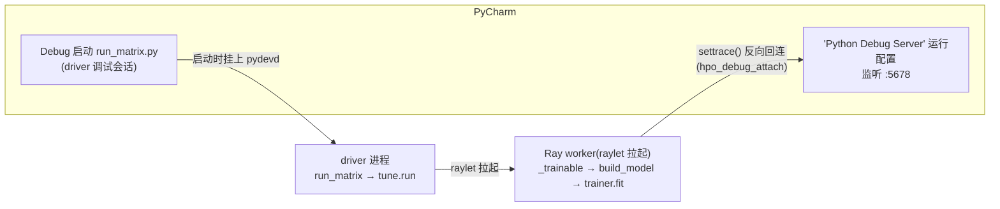

> **语言：** [English](debugging_ray_hpo.md) | 中文

# 在 Ray Tune trial 内部调试(PyCharm 断点进 `_trainable`)

如何在真实矩阵入口(`experiments/hydro_llm/run_matrix.py`)驱动下,让 IDE 断点命中
Ray Tune trial **内部**的代码 —— 即 Ray worker 里运行的 `_trainable`、`build_model`、
`trainer.fit`。方案确立于 2026-08-10,已实测验证(提交 `83f541d` + `7c6ebf5`)。

## 1. 为什么常规调试进不了 trial

Ray 2.x 永远把 Tune trainable 放进 **raylet(Ray 的 C++ 节点代理)拉起的 worker 进程**
执行,绝不在你启动的 driver 进程里:

- PyCharm 的 **Debug** 启动只把 pydevd 挂到 **driver**(运行 `run_matrix.py` →
  `tune.run(...)` 的进程)。driver 侧断点 —— `build_overrides`、`build_optimizer`、
  `tune.run` 调用行、post-HPO retrain —— 正常命中。
- raylet 拉起 worker 不经过 Python 的 `subprocess`/`multiprocessing` 机制,PyCharm 的
  "自动附加子进程"跟不进去,`_trainable` 内的断点在 worker 里根本没被注册。
- `hpo_local_mode: true` 改变不了这一点:在 Ray 2.x 它只等于
  `ray.init(num_cpus=1)` = **trial 顺序执行,但仍在 worker 进程里**。真正的进程内
  `local_mode` 标志已被 Ray 2.x 移除(见
  [ray_optimizer.py](../liulian/optim/ray_optimizer.py) 的 `_run_ray` 初始化块)。

可行的模式是**反向连接**:worker 自己回拨到一个正在监听的 PyCharm
"Python Debug Server"(`pydevd_pycharm.settrace`),连上后断点即可在该 worker 内生效。



## 2. 一次性设置

1. **安装包**(本仓库 `.venv` 已装):

   ```bash
   uv pip install pydevd-pycharm
   ```

   若之后连接报协议/握手错误,改装与你 PyCharm build 匹配的版本:**Help → About**
   查看 build 号(如 `PY-243.x`),然后 `uv pip install "pydevd-pycharm~=243.0"`。

2. **在 PyCharm 建 Debug Server 运行配置**:
   1. **Run → Edit Configurations… → + → Python Debug Server**(模板列表长的话搜
      "debug server")。
   2. 命名如 `ray-attach`;**Port** 填 `5678`;**IDE host name** 保持 `localhost`。OK。

## 3. 每次调试的流程(顺序很重要)

1. **先启动 Debug Server**:右上角运行配置下拉框选 `ray-attach`,点**绿色虫子
   (Debug)按钮**。Debug 工具窗口打开,控制台显示:

   ```
   Starting debug server at port 5,678
   ...
   Waiting for process connection…
   ```

   保持开着不用管 —— 它会一直等,并服务每一个连上来的 trial。

2. **激活配置键**:在
   [experiments/hydro_llm/configs/debug.yaml](../experiments/hydro_llm/configs/debug.yaml)
   的 HPO 段取消注释:

   ```yaml
   hpo_debug_attach: localhost:5678
   ```

   可取值:`true`(→ `localhost:5678`)或 `"host:port"`。

3. **设断点** —— 两侧都可用。技巧:**条件断点**在反向回连的 worker 里同样有效:
   右键红色断点 → **Condition** 栏填 Python 表达式(如在 `_compose_prompt` 的
   `entity_str = ...` 那一行,条件填 `bool(entity_desc)` —— 条件在该行执行**前**
   求值,所以要测输入;在它之后的任意行则可用 `entity_str != ''`)。表达式为真
   时才暂停。
   - driver 侧:`run_matrix.main`、`build_overrides`、`build_optimizer`、
     `tune.run(run_trainable, **run_kwargs)` 那行、post-HPO retrain;
   - worker 侧:`_trainable`(如 `merged = {**base_config, **config}`)、
     `build_model`、`timellm.forecast`、`ForecastTrainer.fit`。

4. **照常跑真实入口** —— 用你平时的 **Debug** 方式启动 run_matrix 运行配置
   (普通 Run 也行,但那样只有 worker 侧断点会停;Debug 两侧全覆盖)。典型
   PyCharm 配置:Script 填 `experiments/hydro_llm/run_matrix.py`,参数
   `--phase full --arch timellm --datasets swiss-river-1990 --modes none --seeds 2026
   --hpo-num-samples 2`,环境变量 `HYDRO_DEBUG=1;HF_HUB_OFFLINE=1;TRANSFORMERS_OFFLINE=1`,
   工作目录 = 仓库根。(`HYDRO_DEBUG=1` 让 `--config` 默认取 debug.yaml。)

5. **预期现象**,按顺序:
   1. trial 输出打印回连确认:

      ```
      [hpo_debug_attach] Ray worker pid=<N> attached to PyCharm debug server localhost:5678
      ```

   2. Debug 工具窗口出现**两个会话标签页** —— driver 会话 + `ray-attach` server 会话
      (连上的 worker 挂在后者下面)。断点停在哪个进程,就切到对应标签页查看。
   3. debug.yaml 默认 `hpo_local_mode: true`,trial 顺序执行 —— worker 一个接一个
      回连,每个新 trial 里断点会再次命中。

6. **调试完:把键重新注释掉。** 键激活而 server 没开时,下一次运行会立即大声
   `RuntimeError` —— 这是有意设计("你要求调试,静默不调试地跑掉才是最坏结局"),
   但也意味着忘了注释会挡住正常运行。

## 4. 无界面 / 命令行验证

同一条路径可以完全不点 IDE 来验证(本功能的实测就是这么做的;前提 server 在监听):

```bash
HYDRO_DEBUG=1 HF_HUB_OFFLINE=1 TRANSFORMERS_OFFLINE=1 \
  .venv/bin/python experiments/hydro_llm/run_matrix.py \
  --phase full --arch timellm --datasets swiss-river-1990 --modes none \
  --seeds 2026 --hpo-num-samples 2 --run-tag attachtest
```

然后查 cell 日志中的回连行:

```bash
grep -a "hpo_debug_attach" artifacts/hydro_llm/attachtest/*/run.log
```

预期:出现 `[hpo_debug_attach] Ray worker pid=... attached to PyCharm debug server
localhost:5678` 且零 Traceback。若你在 PyCharm 里设了断点,这个命令行运行会真的
停在断点上(F9 放行)。

## 5. 故障排查(每一行都是实际踩过的)

| 现象 | 原因 | 处理 |
|---|---|---|
| `_trainable` 断点不命中,trial 输出里没有 attach 行 | `hpo_debug_attach` 还是注释状态(反向连接从未激活) | 取消注释(§3 第 2 步) |
| trial 内 `RuntimeError: ... attaching to the PyCharm Debug Server at localhost:5678 failed with ConnectionRefusedError ...` | Debug Server 没启动(或端口不对) | **先**启动 `ray-attach`(§3 第 1 步);核对端口 |
| `TypeError: settrace() got an unexpected keyword argument 'stdoutToServer'` | pydevd-pycharm ≥2xx 把重定向参数改成蛇形命名,旧驼峰名在连接前就崩 | 已在 `7c6ebf5` 修复(只传全版本通用参数)。还看到此错说明代码树早于该修复 —— 拉最新 |
| attach 行打印了但断点仍穿透 | 安装的 pydevd 与你 PyCharm build 协议不匹配 | 按 §2 第 1 步装匹配版本;重启 server 和运行 |
| PyCharm server 控制台出现 `Warning: wrong debugger version. ... pip install pydevd-pycharm~=<build>`,但 PyPI 上**没有**该版本(EAP/snap 构建常见) | PyPI 发布滞后于 PyCharm 构建 | 运行 `bash scripts/install_pycharm_debugger.sh` —— 自动定位 PyCharm 安装、把其自带的逐位匹配调试器 egg 解压进 venv 并验证导入(uv 装不了 egg)。venv 重建或 PyCharm 升级后重跑一次即可(2026-08-10 实测有效) |
| `RuntimeError: hpo_debug_attach is set but pydevd-pycharm is not installed` | 运行所用解释器缺包 | `uv pip install pydevd-pycharm` 装进该 venv |
| driver 侧断点不停(worker 侧正常) | run_matrix 用了普通 Run 启动 | 改用 Debug 启动 run_matrix |

## 6. 设计说明 / 安全护栏

- 钩子位于 `_trainable` 入口
  ([ray_optimizer.py](../liulian/optim/ray_optimizer.py) 的 `_maybe_attach_debugger`),
  在任何重活之前;键缺省 = 完全无操作,真实/集群路径零影响。
- 失败一律大声(缺包、连不上):dev 场景的回退纪律 —— 静默不调试地跑掉违背调试目的。
- `suspend=False`:回连本身绝不暂停,只有你的断点会。
- **仅限本地调试**:`hpo_debug_attach` 绝不可同步进集群配置 —— 计算节点连不到你的
  IDE,每个 trial 都会大声死掉。
- 回归测试:`tests/runtime/test_optim.py::TestHpoDebugAttach`(缺省无操作 / server
  不可达大声报错 / 缺包报错带安装提示 / settrace 只传版本稳定参数)。
