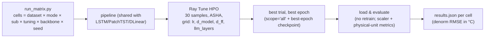

# Entity Identity in Reprogrammed LLM Forecasters: What Does a Frozen Language Model Need to Know About a River Station?

*Progress report for the advisor meeting, 2026-08-11. Written as the known part of the
paper; sections still being produced are marked 🔵 with the job that produces them.
Repository: `liulian-python`, branch `hydro-llm-2026-08`.*

---

## Abstract

We study how the identity of a forecasting entity, in our case a river gauging
station, should be injected into a reprogrammed frozen LLM forecaster (Time-LLM).
Prior work on classical models shows that per-entity identifiers change forecasting
accuracy by large margins, yet LLM-based forecasters receive identity only through a
hand-written dataset description whose role has never been isolated. We build a
design space that factorizes identity injection along two axes, representation
source (text vs learned vector) times injection position (prompt prefix vs additive
patch embedding), and evaluate all four cells plus sub-variants on three Swiss river
water temperature datasets under a matched HPO protocol. Preliminary single-seed
results show that a learnable numeric identity improves Test MSE by 19.4% on the
entity-rich dataset while a textual description changes it by +2.2%, and that a
capacity-matched random identity recovers nearly the full numeric gain (−18.4%),
which points to per-entity distinctness rather than learned content as the active
mechanism. The full HPO-matched grid is running (🔵 jobs 11866831–11866846); the
analysis battery that will separate distinctness from content, and knowledge from
fitting, is specified in §7.

---

## 1. Introduction

Time series foundation work increasingly routes forecasting through frozen large
language models. Time-LLM [1] reprograms patched series into the token space of a
frozen GPT-2/LLaMA and conditions it with a natural language "Prompt-as-Prefix".
This construction quietly bundles three different things into one prompt: dataset
semantics, task instructions, and input statistics. None of them identifies WHICH
entity produced the window.

Entity identity matters in classical settings. On the Swiss river network benchmark
[9], adding a one-hot station identifier to an LSTM reduces RMSE by 56% (1.17 °C in
physical units). In hydrology, Li et al. [7] report that RANDOM static vectors match
physically meaningful catchment descriptors in gauged basins, and Min et al. [8]
report a similar effect, which raises the same mechanism question we ask for LLMs.
For reprogrammed LLM forecasters the question is open in both directions, whether
identity helps at all through a frozen interface, and through WHICH pathway it
should enter.

There is also a structural reason to expect identity to be missing. Time-LLM (like
PatchTST [3]) applies instance normalization (RevIN [2]) to every input window, and
the per-window affine statistics are exactly where the station's level and amplitude
live. Two stations that differ by 7 °C in level become pointwise identical inputs
after RevIN (§4.1). The model can only distinguish them by shape, so any per-station
information must be re-injected downstream of the normalization.

**Contributions (planned paper claims, each tied to an experiment):**

1. A factorized design space for entity identity in reprogrammed LLM forecasters,
   representation source × injection position, that upgrades the usual three-point
   comparison to a full grid (§3).
2. A matched-budget evaluation of the grid on three real hydrological datasets with
   a fixed cross-model protocol (§5). 🔵 running.
3. A distinguisher-vs-content decomposition of the text pathway (shuffled and
   symbol-code prompts), which no prior LLM-TS work isolates (§6.3). 🔵 queued.
4. A mechanism analysis (linear probes, attention maps, capacity-matched controls)
   that separates identity-as-signal from identity-as-interface-workaround (§7).

## 2. Related work

**Reprogrammed and prompted LLM forecasters.** Time-LLM [1] freezes the backbone and
trains a reprogramming layer plus output head; GPT4TS/OneFitsAll [4] fine-tunes
positional embeddings and layer norms with no prompt pathway at all, which makes it
our negative control; TEMPO [5] adds decomposition, AutoTimes [6] autoregressive
time tokens. Among these only Time-LLM and UniTime consume written text, and no
hydrological application of prompt-as-prefix exists to our knowledge, which is the
gap our swiss prompts fill.

**Entity identifiers in classical forecasters.** One-hot, learned embedding,
coordinate, and random identifier features are standard in global forecasting
models; the swiss benchmark [9] and Li et al. [7] give the strongest evidence that
distinctness alone can carry the effect. Our A2 ladder (§3) ports exactly this
ladder into the LLM setting.

**Normalization and identity erasure.** RevIN [2] removes per-window mean and scale.
We measured the consequence on PatchTST directly: identity features concatenated to
the input are erased by instance normalization (+30–85% error regression), while the
same identity added AFTER patch embedding survives (§6.4). This motivates our
model-layer injection sites.

**Do LLMs use meaning or surface patterns?** The context parroting literature and
the pseudo-alignment critique (KDD 2025) argue that prompt text can act as a mere
bias term. Our shuffled-prompt and symbol-code arms make this testable for entity
descriptions specifically (§6.3), and the knowledge-vs-fitting battery (doc
[06](06-KNOWLEDGE-VS-FITTING.md)) extends it beyond identity.

## 3. Method: a factorized identity design space

One run selects one **Level-A mode** (the carrier of identity), orthogonally one
**tuning depth** and one **backbone**:

| | injection = prompt/prefix | injection = additive (patch embeds) |
|---|---|---|
| **source = text** | `entity_description` | `text_embedding` |
| **source = learned** | `soft_prompt` | `numeric_embedding` (A2 ladder) |

`none` sits outside the grid as the baseline whose prompt is byte-identical to
official Time-LLM. The A2 ladder refines the learned-additive cell into
learnable / random / one-hot / sinusoidal / coordinates variants, which is the
distinctness-vs-capacity control set. The A1 ladder refines the text cell by prompt
richness, `default` (authored hydrological text) / `minimal` / `stats` /
`shuffled` / `symbol` (§6.3). Tuning depth is `frozen → ln_only → LoRA` [10];
backbones are GPT-2, BERT, LLaMA-7B.

### 3.1 Formalization

Let a window be $x \in \mathbb{R}^{T\times 1}$ (per-station univariate, $T=96$
with $seq\_len=90$). RevIN first maps

$$\tilde{x}_t = \frac{x_t - \mu_x}{\sigma_x + \varepsilon},\qquad
\mu_x = \tfrac1T\sum_t x_t,\ \ \sigma_x^2 = \tfrac1T\sum_t (x_t-\mu_x)^2,$$

and the inverse transform restores $\mu_x,\sigma_x$ on the output. Patching maps
$\tilde{x}$ to $P$ patches embedded as $E \in \mathbb{R}^{P\times d_{model}}$.
Additive identity injects a station vector $e_s \in \mathbb{R}^{d_{model}}$
(learned, random, projected one-hot/sinusoidal/coordinates, or a projected frozen
text embedding):

$$E' = E + \mathbf{1}\, e_s^{\top}.$$

Reprogramming is cross-attention from patch tokens to $V'$ text prototypes derived
from the frozen vocabulary embeddings $W \in \mathbb{R}^{V\times d_{llm}}$:

$$Z = \mathrm{softmax}\!\left(\frac{(E'W_Q)(W'W_K)^{\top}}{\sqrt{d_k}}\right)(W'W_V)
\in \mathbb{R}^{P\times d_{llm}}.$$

The prompt pathway prepends embedded text tokens $C \in \mathbb{R}^{L\times d_{llm}}$
(dataset description, task instruction, optional entity segment, input statistics
with FFT top-5 lags computed by autocorrelation
$R(\tau)=\mathrm{IFFT}(\mathrm{FFT}(\tilde{x})\cdot\overline{\mathrm{FFT}(\tilde{x})})$),
so the frozen LLM consumes $[C; Z]$ and only the reprogramming layer, the head, and
(depending on tuning depth) LayerNorms or LoRA adapters train.

### 3.2 Pipeline

One entry point (`experiments/hydro_llm/run_matrix.py`), one training pipeline for
every model family, per-experiment config and search-space files
(`experiments/hydro_llm/configs/`). Cells run on UBELIX as 24 h SLURM segments
chained with `afterany` dependencies; Ray Tune resumes partial cells across
segments.

## 4. Experimental setup

**Datasets.** Three Swiss river water temperature collections (daily means, minmax
scaled, per-entity split 80/20): swiss-river-1990 (28 stations, 1990–2020,
entity-rich), swiss-river-2010 (larger station set, shorter span), swiss-river-zurich
(city subnetwork). Station coordinates are CH1903/LV03; the authored prompts state
only facts traceable to the data or cited literature, e.g. the warming trend in the
1990 collection is +0.268 °C/decade by Theil–Sen on ≥300-day years (measured on the
dataset), while the national literature value is +0.33 ± 0.03 °C/decade (Michel et
al.); provenance per phrase in [02 §10](02-PROMPT-DESIGN.md).

**Protocol.** Seed 2026 for every model family (multi-seed on hold until the design
is fixed); batch 32, seq_len 90, pred_len 7, patch 16/8 shared with PatchTST;
train_epochs 30 with patience 10 (early stopping picks the epoch, never a hardcoded
count); bf16 mixed precision exactly as official Time-LLM; HPO 30 samples over
{lr}×{d_model}×{d_ff}×{llm_layers} with ASHA, identical budget for every arm of a
comparison. The `none` prompt reproduces official Time-LLM byte-for-byte, and the
port was verified bit-exact against the official repository on ETTh1 (per-epoch
losses identical; Test MSE 0.3908 / MAE 0.4159).

**Fairness rules.** A comparison never mixes precision, search space, prompt file,
or trial budget; changes deploy only at tier boundaries. Selection uses each
trial's best validation epoch (`scope='all'`) and loads that epoch's checkpoint,
so the selected value, the reported number, and the evaluated weights refer to the
same epoch.

## 5. Results

### 5.1 Classical-model reference points (done, published numbers of the benchmark round)

| model | identifier | effect on swiss-1990 | reading |
|---|---|---|---|
| LSTM | one-hot | **−56% RMSE** (≈1.17 °C) | identity dominates architecture |
| PatchTST | one-hot (add_after_patch) | −7.5% | attenuated by patching |
| DLinear | one-hot | ±0.25% | linear model cannot exploit it |

The LSTM effect sets the scale of what identity is worth in this domain and makes
the LLM question non-trivial, whether a frozen-backbone forecaster can capture any
of this margin.

### 5.2 Time-LLM identity effects (single seed, pre-HPO harness anchors)

Sanity anchors from the validated harness (seed 2026, fixed canonical hypers, Test
MSE on swiss-1990; superseded for the paper by the HPO reruns of §5.4 but stable in
direction):

| mode | Test MSE | Δ vs none |
|---|---|---|
| none | 0.014177 | — |
| entity_description (text) | 0.014485 | **+2.2%** |
| numeric_embedding (learnable) | 0.011433 | **−19.4%** |
| random_embedding (fixed random) | 0.011569 | **−18.4%** |

Two observations drive the paper. First, the numeric pathway carries a large gain
while the text pathway carries none, through the same frozen backbone. Second, a
capacity-matched RANDOM identity recovers 95% of the learnable gain, the same
signature Li et al. [7] found for classical hydrological models, which suggests
per-entity distinctness rather than learned content is the mechanism.

### 5.3 Identity is domain-dependent (Time-LLM 2×2, single seed)

The same numeric identity that helps the entity-rich swiss data (−17.6% in the
cross-check run) HURTS ETTh1 (+2.3%), whose channels are sensor variables of one
site rather than distinct entities. Identity injection is therefore not a free
regularizer; its value tracks how entity-like the channels actually are.

### 5.4 Tier-0 v2, HPO-matched main grid 🔵 running

Full switch to the debugged regime completed 2026-08-10 (bf16, llm_layers
{3,6,12}, 30-sample matched HPO, self-healing tokenizer). Two arms run as chained
24 h segments, `none` first, then `numeric_embedding` (jobs 11866831–11866838
promptfix arm; 11866839–11866846 ETT-description control arm; ~27 h per cell
estimated).

| cell (dataset × mode) | promptfix arm | ETT-control arm |
|---|---|---|
| 1990 × none | 🔵 running | 🔵 queued |
| 2010 × none | 🔵 queued | 🔵 queued |
| zurich × none | 🔵 queued | 🔵 queued |
| 1990/2010/zurich × numeric_embedding | 🔵 phase B (auto-starts) | 🔵 phase B |
| 1990 × entity_description | 🔵 after phase B | 🔵 after phase B |

The two arms differ ONLY in the dataset description (authored swiss text vs
official ETT electricity text), so their difference isolates the value of a
domain-correct description at matched budget.

## 6. Ablations and supplementary experiments

### 6.1 Optimizer and schedule diagnostics (done)

A 100-epoch diagnostic on 1990×none shows both lr 1e-2 (canonical) and 1e-3
converge by epoch ≈8 under early stopping; lr 1e-3 wins on validation (denorm RMSE
1.746 vs 1.811), so the HPO grid contains both. Both values therefore appear in
the search space rather than being fixed by convention.

### 6.2 Backbone depth (llm_layers) 🔵 in the running grid

The official default truncates GPT-2 to 6 layers, the paper's own Table 6 reports
the full 12 layers 2.7% better, and FSCA reports 4–6 optimal. We let validation
decide: {3, 6, 12} is an HPO dimension of every v2 cell.

### 6.3 Distinguisher vs content (the prompt ladder) 🔵 queued, arms implemented

The text pathway confounds two roles, a distinguisher (any distinct string
separates stations) and content (hydrological facts help). The ladder separates
them: `none` → `symbol` (5-letter consonant codes, pure distinctness, no ordinal
leak) → `minimal` (positional id) → `shuffled` (same words as default, order
destroyed) → `default` (authored text) → `stats` (adds per-station TRAIN-only
statistics), each × {frozen, LoRA}. Readout rules are pre-registered in
[02 §9](02-PROMPT-DESIGN.md): `shuffled ≈ default` implies the model reads the
prompt as a distinctness token, not as language; `symbol ≈ default` implies content
is irrelevant; gains appearing only under LoRA imply the frozen interface, not the
information, is the bottleneck.

### 6.4 Injection position × normalization (done on PatchTST)

Identity concatenated to the INPUT is erased by instance normalization (+30–85%
error), identity added AFTER patch embedding survives. This fixes `add_after_patch`
as the additive site and explains mechanistically why identity must bypass RevIN
(§4.1 example: two stations 7 °C apart normalize to pointwise identical inputs).

### 6.5 Identity × trainability interaction (2×2) 🔵 designed

`{numeric_embedding on/off} × {frozen, LoRA}` on 1990. If the embedding gain
shrinks under LoRA, identity mainly compensates the frozen interface; if it
persists, identity is signal the backbone cannot recover by adaptation. The random
variant repeats the 2×2 with pure distinctness.

### 6.6 Further queued controls

Norm-range 2×2 (minmax vs z-score × identity); Chronos zero-shot negative control;
UniTime as a second native-text backbone; GPT4TS as the no-prompt negative control
(implemented, `--arch gpt4ts`); backbone sweep GPT-2/BERT/LLaMA (weights staged on
the cluster).

## 7. Analysis plan, what we do when the numbers land

The analysis battery is specified before results to avoid post-hoc rationalization
(full menu in [03-ANALYSIS-PLAN.md](03-ANALYSIS-PLAN.md)).

1. **Main-effect table.** Per dataset, mode vs none with matched HPO; report
   scaler-space MSE and physical denorm RMSE (°C); single seed marked as such,
   multi-seed pass follows once the design is frozen.
2. **Distinctness vs content decision tree (from §6.3).** Compare
   symbol/shuffled/default; the pre-registered inequalities decide which claim the
   paper makes, and every branch has a publishable conclusion.
3. **Capacity-matched controls.** learnable vs random vs one-hot vs sinusoidal;
   if random ≈ learnable at matched dimension, the mechanism claim is distinctness
   and the Li et al. bridge becomes the discussion anchor.
4. **Linear probes (Hewitt–Liang controlled).** Probe station identity from patch
   representations before and after injection, with a selectivity control, to show
   the identity actually reaches the representation rather than the loss surface.
5. **Attention and embedding geometry.** Prompt-to-patch attention mass, and t-SNE
   of per-station mean representations colored by basin; the falsifiable statement
   is that injection increases between-station separation (silhouette) without
   destroying temporal structure.
6. **Interaction reading (from §6.5).** The 2×2 interaction term decides between
   identity-as-signal and identity-as-interface-workaround; either way it answers
   the "is the frozen interface the bottleneck" question.
7. **Knowledge vs fitting battery.** Cross-station window transplants, prompt-swap
   at inference, and the T1–T12 tests of [06](06-KNOWLEDGE-VS-FITTING.md) decide
   whether any text gain is semantic or surface-statistical.
8. **Failure handling.** If v2 reverses a harness-era direction, the resolution
   protocol is fixed: check per-cell resolved configs first, then attribute to HPO
   coverage before claiming a science difference; no number enters the paper
   without its `results.json` and config hash.

## 8. Limitations and threats

Single seed so far (multi-seed pass planned after design freeze); three datasets
from one country and one variable; entity_description exists only for the 1990
stations (text for 2010/zurich needs authoring); LLaMA cells pending cluster time;
the ETT-control arm shares the swiss task instructions, so it controls the dataset
description only.

## 9. Engineering notes that affect validity (short)

A degenerate local tokenizer (vocab 1 from an incomplete cache) silently killed the
whole text pathway in early local smokes; the pipeline now fails loudly and
self-heals, and every text result predates or postdates this fix explicitly. The
GPU partition wall is a hard 24 h, so all sweeps run as dependency-chained resumable
segments. Best-trial selection uses per-trial best epochs and loads the matching
checkpoint (verified against Ray internals). These notes become one appendix
paragraph in the paper.

## References

[1] M. Jin et al. Time-LLM: Time Series Forecasting by Reprogramming Large Language
Models. ICLR 2024. arXiv:2310.01728.
[2] T. Kim et al. Reversible Instance Normalization for Accurate Time-Series
Forecasting against Distribution Shift. ICLR 2022.
[3] Y. Nie et al. A Time Series is Worth 64 Words: Long-term Forecasting with
Transformers. ICLR 2023. arXiv:2211.14730.
[4] T. Zhou et al. One Fits All: Power General Time Series Analysis by Pretrained
LM. NeurIPS 2023. arXiv:2302.11939.
[5] D. Cao et al. TEMPO: Prompt-based Generative Pre-trained Transformer for Time
Series Forecasting. ICLR 2024. arXiv:2310.04948.
[6] Y. Liu et al. AutoTimes: Autoregressive Time Series Forecasters via Large
Language Models. NeurIPS 2024. arXiv:2402.02370.
[7] X. Li et al. Regionalization in a Global Hydrological Deep Learning Model: From
Physical Descriptors to Random Vectors. Water Resources Research, 58, 2022.
[8] Min et al. 2022 (random static features in rainfall-runoff LSTMs; full entry in
[05-SURVEY-NOTES.md](05-SURVEY-NOTES.md)).
[9] Swiss river network benchmark, github.com/jajupmochi/swiss-river-network-benchmark.
[10] E. Hu et al. LoRA: Low-Rank Adaptation of Large Language Models. ICLR 2022.
arXiv:2106.09685.
[11] A. Michel et al. Stream temperature and discharge evolution in Switzerland over
the last 50 years. Hydrol. Earth Syst. Sci., 2020 (national trend +0.33 ± 0.03
°C/decade).

*Survey positioning (novelty checked against ~450 references across four 2024–2025
LLM-for-time-series surveys): [05-SURVEY-NOTES.md](05-SURVEY-NOTES.md).*
